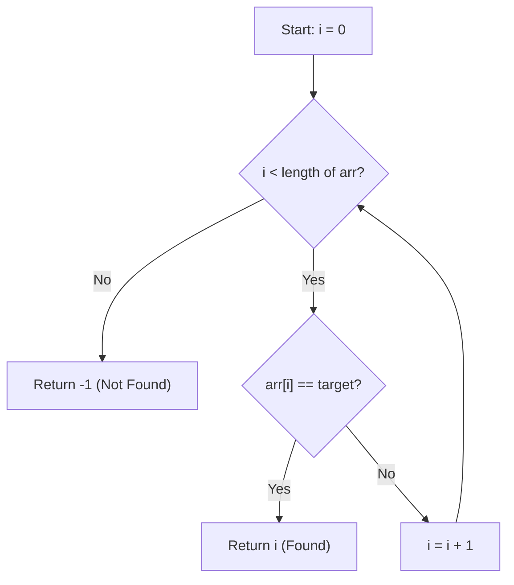

# Linear Search — Complete Learning Guide

## 1. What Is It?

Linear Search (also called **Sequential Search**) is the simplest way to find a value inside a
list: start at the first element and check every element, one after another, until you either
find the target or run out of elements.

Think of it like looking for your friend's name in an unsorted stack of exam papers — you flip
through them one by one because they are in no particular order, so there's no shortcut.

**Key fact:** Linear Search does **not** require the array to be sorted. This is its biggest
advantage over Binary/Interpolation Search.

## 2. Algorithm (Step-by-Step)

1. Start at index `i = 0`.
2. Compare `arr[i]` with the `target`.
3. If they match → return `i` (found).
4. If not, move to `i + 1`.
5. Repeat steps 2–4 until `i` reaches the end of the array.
6. If the loop finishes with no match → return `-1` (not found).

## 3. Visual Walkthrough

Searching for `target = 7` in `arr = [4, 2, 7, 1, 9]`:

```text
Index:   0    1    2    3    4
Array: [ 4 ,  2 ,  7 ,  1 ,  9 ]

Step 1: compare arr[0]=4 with 7 → no match
         ↑
        [4], 2, 7, 1, 9

Step 2: compare arr[1]=2 with 7 → no match
              ↑
         4, [2], 7, 1, 9

Step 3: compare arr[2]=7 with 7 → MATCH! ✅ return index 2
                   ↑
         4, 2, [7], 1, 9
```

If the target were `6` (not present), the pointer would walk all the way to index 4, fail the
comparison there too, and the function would return `-1`.

### Flow Diagram



## 4. Complexity Analysis

| Case    | Time     | When it happens                          |
| ------- | -------- | ----------------------------------------- |
| Best    | O(1)     | Target is the very first element          |
| Average | O(n)     | Target is somewhere in the middle         |
| Worst   | O(n)     | Target is the last element or not present |

**Space Complexity:** O(1) — only a loop counter is used, no extra memory.

## 5. When Should You Use It?

✅ **Use Linear Search when:**
- The data is **unsorted** and sorting it first would cost more than a single search.
- The dataset is **small**, so O(n) is fast enough in practice.
- You are searching a **linked list** or any structure without random access (binary search
  needs O(1) access to the middle element, which linked lists don't provide efficiently).
- You need to find **all occurrences** of a value, or search based on a **custom/complex
  condition** rather than plain equality.

❌ **Avoid it when:**
- The array is large and sorted (Binary Search — O(log n) — will be far faster).
- You will search the same collection repeatedly (sort once, then binary search many times).

## 6. Real-World Use Cases

- Searching for a contact by name in a small, unsorted phone list.
- Finding the first item matching a filter in a UI list (e.g., "first unread email").
- Scanning log files line-by-line for a keyword.
- As a fallback/base case inside more complex algorithms when the dataset shrinks to a tiny size.

## 7. Full Python Implementation

```python
def linear_search(arr, target):
    for i in range(len(arr)):
        if arr[i] == target:
            return i
    return -1


# --------- Example Usage ---------
if __name__ == "__main__":
    arr = [4, 2, 7, 1, 9]
    target = 7
    index = linear_search(arr, target)

    if index != -1:
        print(f"Target found at index {index}")
    else:
        print("Target not found in the list")
```

## 8. Quick Recap

| Property        | Value                    |
| ---------------- | ------------------------ |
| Works on         | Sorted or unsorted data  |
| Time (avg/worst) | O(n)                     |
| Time (best)      | O(1)                     |
| Space            | O(1)                     |
| Approach         | Iterative, brute-force   |
