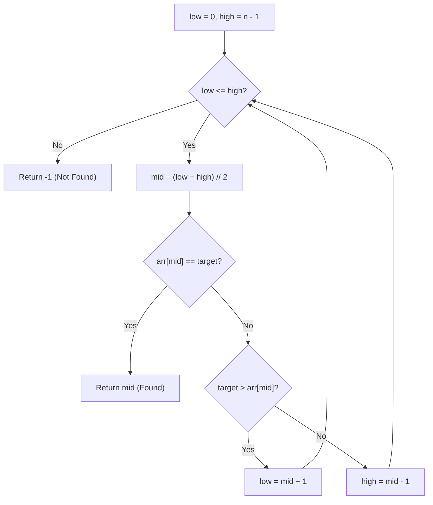

# Binary Search — Complete Learning Guide

## 1. What Is It?

Binary Search finds a target value in a **sorted** array by repeatedly cutting the search space
in half. Instead of checking every element like Linear Search, it jumps straight to the middle
and uses the sort order to eliminate half of the remaining elements at every step.

Analogy: guessing a number between 1 and 100. Instead of guessing 1, 2, 3, 4... you guess 50.
If the answer is higher, you know 1–50 are eliminated in one shot. That's the power of halving.

**Key requirement:** the array **must be sorted** for Binary Search to work correctly.

> Note on this repo's implementation: [`02_BinarySearch`](./02_BinarySearch) calls
> `arr.sort()` internally before searching, so it works even if you pass an unsorted list —
> but that mutates your original list and adds an O(n log n) sort cost. In practice, sort once
> and reuse the sorted array for multiple searches.

## 2. Algorithm (Step-by-Step)

1. Set `low = 0` and `high = len(arr) - 1`.
2. While `low <= high`:
   - Compute `mid = (low + high) // 2`.
   - If `arr[mid] == target` → return `mid` (found).
   - If `target > arr[mid]` → the target must be in the right half → `low = mid + 1`.
   - If `target < arr[mid]` → the target must be in the left half → `high = mid - 1`.
3. If the loop ends without finding a match → return `-1`.

## 3. Visual Walkthrough

Searching for `target = 7` in the sorted array `[2, 4, 5, 7, 8, 9, 10]`:

```text
Index:   0    1    2    3    4    5    6
Array: [ 2 ,  4 ,  5 ,  7 ,  8 ,  9 , 10 ]

Step 1: low=0, high=6 → mid=3 → arr[3]=7
        [ 2 ,  4 ,  5 , [7],  8 ,  9 , 10 ]
        7 == 7  →  MATCH! ✅ return index 3
```

A case that needs multiple steps — searching for `target = 9`:

```text
Index:   0    1    2    3    4    5    6
Array: [ 2 ,  4 ,  5 ,  7 ,  8 ,  9 , 10 ]

Step 1: low=0, high=6 → mid=3 → arr[3]=7
        9 > 7  →  discard left half, low = mid+1 = 4
          eliminated: [2, 4, 5, 7]     remaining: [8, 9, 10]

Step 2: low=4, high=6 → mid=5 → arr[5]=9
        9 == 9  →  MATCH! ✅ return index 5
```

Each comparison throws away roughly half of the remaining candidates — that's what gives Binary
Search its O(log n) speed.

### Flow Diagram



## 4. Complexity Analysis

| Case    | Time     | When it happens                          |
| ------- | -------- | ----------------------------------------- |
| Best    | O(1)     | Target is exactly the middle element      |
| Average | O(log n) | Typical case                              |
| Worst   | O(log n) | Target is at an extreme or not present    |

**Space Complexity:** O(1) for the iterative version (this implementation) since only `low`,
`high`, and `mid` are tracked. A recursive version would use O(log n) space for the call stack.

**Why O(log n)?** Each step halves the search space: n → n/2 → n/4 → ... → 1. The number of
halvings needed is `log₂(n)`.

## 5. When Should You Use It?

✅ **Use Binary Search when:**
- The data is already **sorted**, or will be searched **many times** (sort once, search
  repeatedly for a huge net win).
- You need guaranteed O(log n) lookups on large datasets.
- You're solving problems like "find the first/last occurrence", "find insertion point", or
  "search in a rotated sorted array" — all classic variants built on this core idea.

❌ **Avoid it when:**
- The data is unsorted and only searched once (sorting cost outweighs the benefit — just use
  Linear Search).
- You're working with a data structure without random access, like a linked list.

## 6. Real-World Use Cases

- Looking up a word in a dictionary or a name in a sorted phone book.
- Searching version numbers, timestamps, or IDs in a sorted database index.
- `bisect` module in Python's standard library (used for maintaining sorted lists efficiently).
- Debugging with `git bisect` — binary search over commit history to find the commit that
  introduced a bug.
- Finding a boundary value, e.g., "the first version where a test starts failing."

## 7. Full Python Implementation

```python
def binary_search(arr, target):
    low = 0
    high = len(arr) - 1
    arr.sort()  # Ensures the list is sorted before applying binary search

    while low <= high:
        mid = (low + high) // 2
        if target == arr[mid]:
            return mid
        elif target > arr[mid]:
            low = mid + 1
        else:
            high = mid - 1
    return -1


# --------- Example Usage ---------
if __name__ == "__main__":
    arr = [10, 2, 7, 5, 8, 4, 9]
    target = 7
    index = binary_search(arr, target)
    if index != -1:
        print(f"Target found at index {index}")
    else:
        print("Target not found in the list")
```

## 8. Quick Recap

| Property        | Value                        |
| ---------------- | ---------------------------- |
| Works on         | Sorted data only              |
| Time (avg/worst) | O(log n)                      |
| Time (best)      | O(1)                          |
| Space            | O(1) iterative / O(log n) recursive |
| Approach         | Divide and conquer            |
