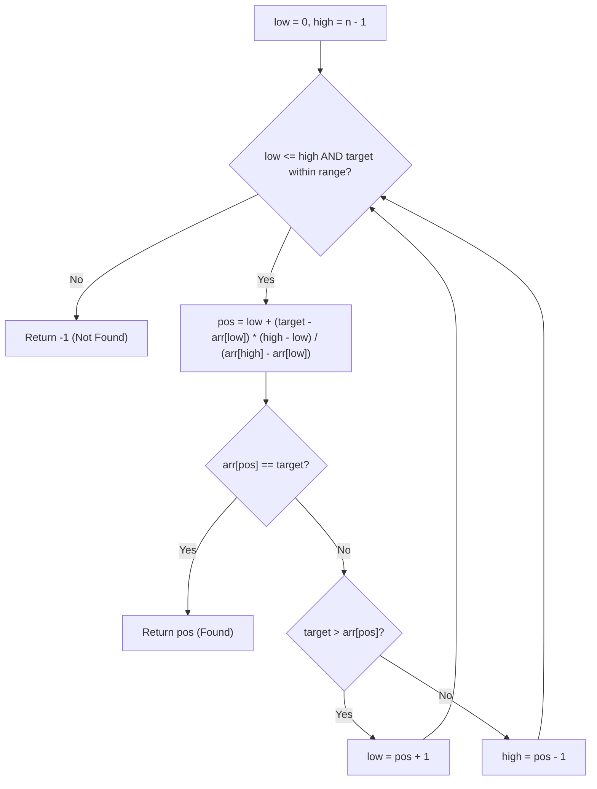

# Interpolation Search — Complete Learning Guide

## 1. What Is It?

Interpolation Search is an improved version of Binary Search for **sorted, uniformly
distributed** data. Instead of always checking the middle element, it makes an educated *guess*
about where the target is likely to be, based on its value.

Analogy: when you open a physical dictionary looking for "Zebra," you don't open it in the
middle — you open it near the **end**, because you know Z is close to the end of the alphabet.
That's interpolation: using the *value* of what you're looking for to guess its *position*.

**Key requirement:** the array must be **sorted**, and works best when values are **uniformly
distributed** (evenly spaced, like `[10, 20, 30, 40, 50]`).

## 2. Algorithm (Step-by-Step)

1. Set `low = 0` and `high = len(arr) - 1`.
2. While `low <= high` **and** `target` is between `arr[low]` and `arr[high]`:
   - If `arr[high] == arr[low]` (avoid divide-by-zero): check `arr[low]` directly.
   - Estimate the probable position using the **interpolation formula**:

     ```text
     pos = low + ((target - arr[low]) * (high - low)) // (arr[high] - arr[low])
     ```

   - If `arr[pos] == target` → return `pos` (found).
   - If `target > arr[pos]` → search the right part → `low = pos + 1`.
   - If `target < arr[pos]` → search the left part → `high = pos - 1`.
3. If no match is found → return `-1`.

### Why this formula?

It's the same idea as linear interpolation on a straight line: assume the values are evenly
spread between `arr[low]` and `arr[high]`, and calculate what *fraction* of the way the target
value is, then apply that same fraction to the *index range*.

```text
fraction = (target - arr[low]) / (arr[high] - arr[low])
pos      = low + fraction * (high - low)
```

## 3. Visual Walkthrough

Searching for `target = 30` in `arr = [10, 20, 30, 40, 50]`:

```text
Index:    0    1    2    3    4
Array: [ 10 , 20 , 30 , 40 , 50 ]

low = 0 (arr[low]=10), high = 4 (arr[high]=50)

pos = 0 + ((30 - 10) * (4 - 0)) // (50 - 10)
    = 0 + (20 * 4) // 40
    = 0 + 80 // 40
    = 2

arr[2] = 30 → MATCH! ✅ return index 2 (found in a single probe!)
```

Compare this to Binary Search on the same array, which would also probe `mid = 2` here — but
for a **skewed** distribution like `[1, 2, 3, 4, 100000]` searching for `4`, interpolation
zooms in near the left almost immediately, while binary search would still check the middle.

### Flow Diagram



## 4. Complexity Analysis

| Case    | Time         | When it happens                                        |
| ------- | ------------ | -------------------------------------------------------- |
| Best    | O(1)         | Target found on the first probe                          |
| Average | O(log log n) | Data is uniformly distributed                             |
| Worst   | O(n)         | Data is skewed/non-uniform (e.g., `[1, 2, 3, ..., 1e9]`) |

**Space Complexity:** O(1) — iterative, no extra data structures.

**Why can it degrade to O(n)?** If the data is heavily skewed (e.g., exponentially growing
values), the formula's position estimate can be consistently far off, causing the search to
shrink the range by only one element at a time — effectively behaving like Linear Search.

## 5. When Should You Use It?

✅ **Use Interpolation Search when:**
- Data is sorted **and** roughly uniformly distributed (timestamps, sequential IDs, sensor
  readings sampled at regular intervals, phone books by numeric ranges).
- You need faster-than-binary-search lookups on very large, evenly-spread datasets.

❌ **Avoid it when:**
- Data distribution is unknown, skewed, or clustered — Binary Search's guaranteed O(log n)
  is safer than risking O(n) worst case.
- The array is small — the overhead of the formula isn't worth it over plain Binary Search.

## 6. Real-World Use Cases

- Searching large sorted numeric datasets with predictable spacing (e.g., timestamps in a
  time-series database, sequential transaction IDs).
- Indexing schemes in databases where keys are roughly evenly distributed.
- Searching sorted files of fixed-format numeric records (e.g., sensor logs).

## 7. Full Python Implementation

```python
def interpolation_search(arr, target):
    low = 0
    high = len(arr) - 1

    while low <= high and arr[low] <= target <= arr[high]:
        # Avoid division by zero
        if arr[high] == arr[low]:
            if arr[low] == target:
                return low
            else:
                return -1

        # Estimate the probable position of the target
        pos = low + ((target - arr[low]) * (high - low) // (arr[high] - arr[low]))

        # Check if estimated position is within bounds
        if pos >= len(arr):
            return -1

        if arr[pos] == target:
            return pos
        elif target > arr[pos]:
            low = pos + 1
        else:
            high = pos - 1

    return -1


# --------- Example Usage ---------
if __name__ == "__main__":
    arr = [10, 20, 30, 40, 50]
    target = 30
    index = interpolation_search(arr, target)
    if index != -1:
        print(f"Target found at index {index}")
    else:
        print("Target not found in the list")
```

## 8. Quick Recap

| Property        | Value                                  |
| ---------------- | --------------------------------------- |
| Works on         | Sorted, ideally uniformly distributed data |
| Time (average)   | O(log log n)                            |
| Time (worst)     | O(n)                                    |
| Space            | O(1)                                    |
| Approach         | Value-based position estimation         |

## 9. Comparing All Three Searching Algorithms

| Algorithm             | Requires Sorted? | Best     | Average      | Worst   | Space |
| ---------------------- | ---------------- | -------- | ------------ | ------- | ----- |
| [Linear Search](./01_LinearSearch.md)          | No               | O(1)     | O(n)         | O(n)    | O(1)  |
| [Binary Search](./02_BinarySearch.md)          | Yes              | O(1)     | O(log n)     | O(log n)| O(1)  |
| [Interpolation Search](./03_InterpolationSearch.md) | Yes (uniform)    | O(1)     | O(log log n) | O(n)    | O(1)  |
