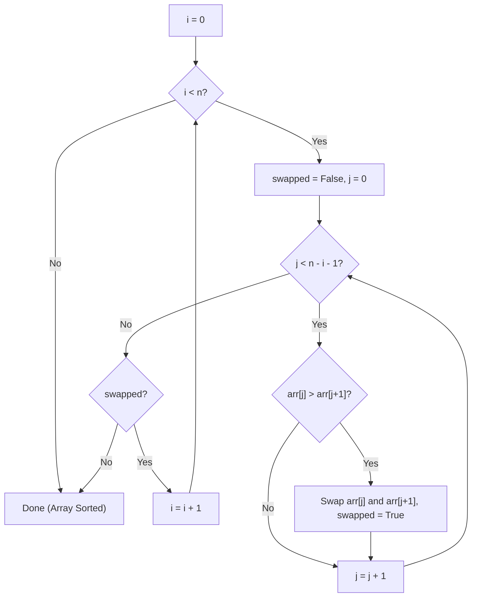

# Bubble Sort — Complete Learning Guide

## 1. What Is It?

Bubble Sort is the simplest sorting algorithm to understand. It repeatedly walks through the
list, compares each pair of **adjacent** elements, and swaps them if they're in the wrong order.
Large elements "bubble up" to the end of the list with each pass — just like air bubbles rising
to the top of water.

## 2. Algorithm (Step-by-Step)

1. Loop over the array for `n` passes (where `n` is the array length).
2. In each pass, walk from the start of the unsorted portion to its end.
3. Compare each pair of adjacent elements `arr[j]` and `arr[j+1]`.
4. If `arr[j] > arr[j+1]`, swap them.
5. After each full pass, the largest remaining element is guaranteed to be in its correct final
   position — so the next pass can ignore it (shrink the range by 1 each time).
6. **Optimization:** if a full pass makes zero swaps, the array is already sorted — stop early.

## 3. Visual Walkthrough

Sorting `[5, 1, 4, 2, 8]`:

```text
Initial: [5, 1, 4, 2, 8]

Pass 1:
  compare (5,1) → swap → [1, 5, 4, 2, 8]
  compare (5,4) → swap → [1, 4, 5, 2, 8]
  compare (5,2) → swap → [1, 4, 2, 5, 8]
  compare (5,8) → no swap
  → end of pass 1: [1, 4, 2, 5, 8]   (8 is now in its final position)

Pass 2:
  compare (1,4) → no swap
  compare (4,2) → swap → [1, 2, 4, 5, 8]
  compare (4,5) → no swap
  → end of pass 2: [1, 2, 4, 5, 8]   (5 is now in its final position)

Pass 3:
  compare (1,2) → no swap
  compare (2,4) → no swap
  → no swaps at all this pass → array is sorted, STOP EARLY ✅

Final: [1, 2, 4, 5, 8]
```

Notice how the largest unsorted value "bubbles" to the right edge after every pass — this is
where the algorithm gets its name.

### Flow Diagram



## 4. Complexity Analysis

| Case    | Time  | When it happens                                      |
| ------- | ----- | ----------------------------------------------------- |
| Best    | O(n)  | Array is already sorted (early-exit optimization fires after 1 pass) |
| Average | O(n²) | Randomly ordered elements                              |
| Worst   | O(n²) | Array is sorted in reverse order                        |

**Space Complexity:** O(1) — sorting happens in-place, only a temp variable is used for swaps.

**Stability:** ✅ Stable — equal elements never get swapped past each other (a swap only
happens when `arr[j] > arr[j+1]`, strictly greater).

**Number of passes:** up to `n - 1` in the worst case; as few as 1 in the best case thanks to
the early-exit optimization.

## 5. When Should You Use It?

✅ **Use Bubble Sort when:**
- Teaching/learning sorting fundamentals — it's the easiest algorithm to trace by hand.
- The array is tiny or **almost sorted** (the optimized version approaches O(n) here).
- You need a dead-simple, stable, in-place sort and performance isn't a concern.

❌ **Avoid it when:**
- The dataset is large — O(n²) becomes painfully slow (e.g., 10,000 elements → ~100 million
  comparisons in the worst case).
- Any production system where Merge Sort, Quick Sort, or Python's built-in `sorted()`
  (Timsort) would be dramatically faster.

## 6. Real-World Use Cases

- Educational tool for teaching algorithmic thinking, loops, and complexity analysis.
- Detecting whether a nearly-sorted list needs just a "light touch" fix (the early-exit
  optimization makes this efficient).
- Rarely used in production — real-world systems rely on Timsort (Python/Java), Introsort
  (C++), or other hybrid algorithms.

## 7. Full Python Implementation

```python
def bubble_sort(arr):
    n = len(arr)
    for i in range(0, n):
        swapped = False
        # Traverse the unsorted part of the list
        for j in range(0, n - i - 1):
            if arr[j] > arr[j + 1]:
                # Swap adjacent elements if they are in the wrong order
                arr[j], arr[j + 1] = arr[j + 1], arr[j]
                swapped = True
        # If no swaps occurred, the array is already sorted
        if not swapped:
            break
    return arr


# --------- Example Usage ---------
if __name__ == "__main__":
    sample = [5, 1, 4, 2, 8]
    sorted_arr = bubble_sort(sample)
    print("Sorted array:", sorted_arr)  # Output: [1, 2, 4, 5, 8]
```

## 8. Quick Recap

| Property | Value |
| -------- | ----- |
| Time (avg/worst) | O(n²) |
| Time (best) | O(n) |
| Space | O(1) |
| Stable | Yes |
| In-place | Yes |
