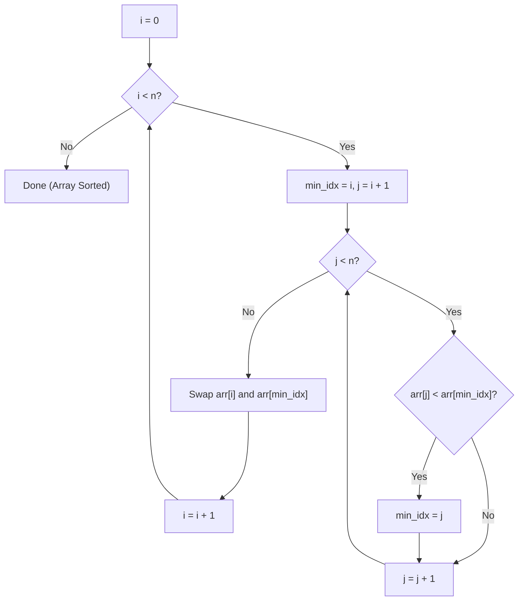

# Selection Sort — Complete Learning Guide

## 1. What Is It?

Selection Sort splits the array into a **sorted** part (front) and an **unsorted** part (back).
On every pass, it scans the entire unsorted part to find the **smallest** element, then swaps it
into place at the front of the unsorted region. The sorted boundary grows by one element each
pass.

Analogy: sorting a hand of cards by repeatedly picking out the smallest card from the remaining
pile and placing it at the end of your sorted row.

## 2. Algorithm (Step-by-Step)

1. For each index `i` from `0` to `n - 1`:
   - Assume `arr[i]` is the minimum (`min_idx = i`).
   - Scan the rest of the array (`j` from `i+1` to `n-1`) to find the actual smallest element.
   - If a smaller element is found, update `min_idx`.
   - After scanning, swap `arr[i]` with `arr[min_idx]`.
2. Repeat until the whole array is processed.

## 3. Visual Walkthrough

Sorting `[64, 25, 12, 22, 11]`:

```text
Initial: [64, 25, 12, 22, 11]

Pass i=0: scan [64, 25, 12, 22, 11] → min is 11 at index 4
          swap arr[0] and arr[4] → [11, 25, 12, 22, 64]
          sorted so far: [11]

Pass i=1: scan [25, 12, 22, 64] → min is 12 at index 2
          swap arr[1] and arr[2] → [11, 12, 25, 22, 64]
          sorted so far: [11, 12]

Pass i=2: scan [25, 22, 64] → min is 22 at index 3
          swap arr[2] and arr[3] → [11, 12, 22, 25, 64]
          sorted so far: [11, 12, 22]

Pass i=3: scan [25, 64] → min is 25 (already in place, no swap needed)
          sorted so far: [11, 12, 22, 25]

Pass i=4: only one element left → done

Final: [11, 12, 22, 25, 64]
```

### Flow Diagram



## 4. Complexity Analysis

| Case    | Time  | Why                                                        |
| ------- | ----- | ------------------------------------------------------------ |
| Best    | O(n²) | Still scans the entire unsorted portion even if already sorted |
| Average | O(n²) | Same scanning cost regardless of input order                 |
| Worst   | O(n²) | Same scanning cost regardless of input order                 |

Unlike Bubble/Insertion Sort, Selection Sort has **no best-case shortcut** — it always performs
the same number of comparisons, because it must scan the whole unsorted part every pass to find
the minimum.

**Space Complexity:** O(1) — sorts in-place using only a few index variables.

**Stability:** ❌ Not stable — swapping the minimum into place can jump it past equal elements,
changing their relative order. Example: `[5a, 5b, 2]` → after finding min `2` at index 2, it
swaps with index 0, giving `[2, 5b, 5a]` — the two `5`s have been reordered.

**Number of swaps:** exactly `n - 1` swaps in the worst case — fewer than Bubble Sort, which
makes Selection Sort attractive when **write/swap operations are expensive** (e.g., writing to
flash memory) even though comparisons are still O(n²).

## 5. When Should You Use It?

✅ **Use Selection Sort when:**
- Memory writes are costly and you want to **minimize the number of swaps** (it does at most
  `n-1` swaps, regardless of input).
- The array is small and simplicity matters more than speed.

❌ **Avoid it when:**
- Stability is required (use Insertion or Merge Sort instead).
- The dataset is large — O(n²) comparisons make it impractical.

## 6. Real-World Use Cases

- Situations where **write operations are far more expensive than comparisons** — e.g.,
  sorting data on EEPROM/flash storage with limited write cycles.
- Teaching selection-based algorithm design (this pattern — "find best candidate, then fix it
  in place" — recurs in greedy algorithms).

## 7. Full Python Implementation

```python
def selection_sort(arr):
    n = len(arr)

    for i in range(n):
        # Assume the minimum element is at the current position
        min_idx = i
        # Find the minimum element in remaining unsorted array
        for j in range(i + 1, n):
            if arr[j] < arr[min_idx]:
                min_idx = j
        # Swap the found minimum element with the first element of the unsorted part
        arr[i], arr[min_idx] = arr[min_idx], arr[i]

    return arr


# --------- Example Usage ---------
if __name__ == "__main__":
    arr = [64, 25, 12, 22, 11]
    sorted_arr = selection_sort(arr)
    print("Sorted array:", sorted_arr)  # Output: [11, 12, 22, 25, 64]
```

## 8. Quick Recap

| Property | Value |
| -------- | ----- |
| Time (all cases) | O(n²) |
| Space | O(1) |
| Stable | No |
| In-place | Yes |
| Swaps | At most n - 1 |
