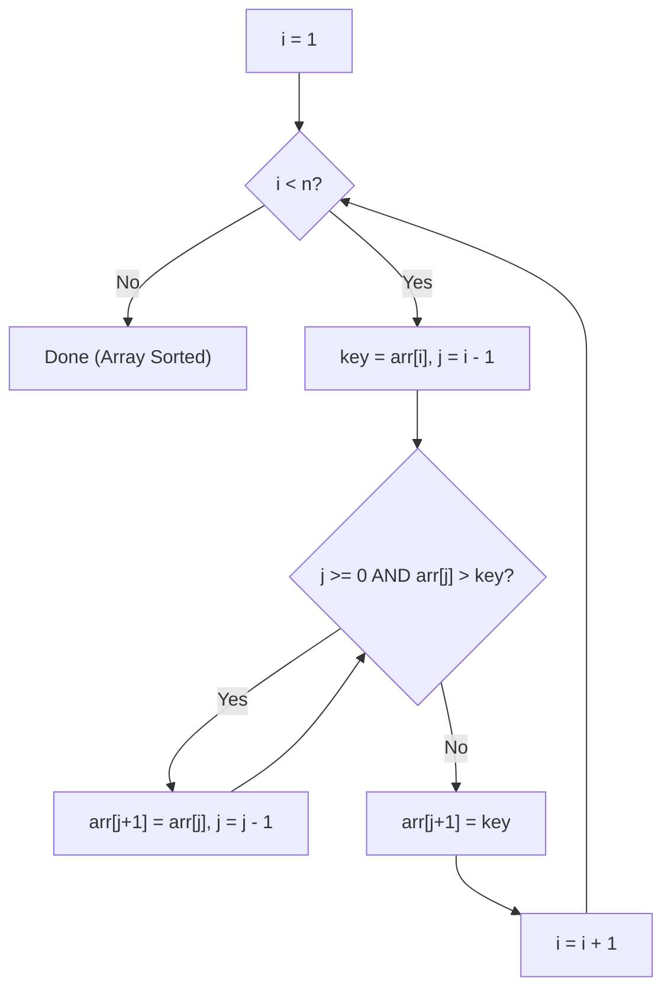

# Insertion Sort — Complete Learning Guide

## 1. What Is It?

Insertion Sort builds the final sorted array one element at a time, exactly like sorting playing
cards in your hand: you pick up a new card and slide it into its correct position among the
cards you've already sorted.

## 2. Algorithm (Step-by-Step)

1. Start from index `i = 1` (treat `arr[0]` as a trivially sorted list of one element).
2. Store `arr[i]` as `key`.
3. Compare `key` with elements before it (`arr[i-1]`, `arr[i-2]`, ...), shifting each element
   one position to the right as long as it's **greater than** `key`.
4. Stop shifting when you find an element `<= key`, or you reach the start of the array.
5. Insert `key` into the gap left by the shifting.
6. Repeat for all `i` from `1` to `n - 1`.

## 3. Visual Walkthrough

Sorting `[12, 11, 13, 5, 6]`:

```text
Initial: [12, 11, 13, 5, 6]
          sorted | unsorted
          [12]   | 11, 13, 5, 6

i=1, key=11: 12 > 11 → shift 12 right → [_, 12, 13, 5, 6] → insert 11 → [11, 12, 13, 5, 6]
          sorted: [11, 12]

i=2, key=13: 12 < 13 → no shift needed → insert 13 in place → [11, 12, 13, 5, 6]
          sorted: [11, 12, 13]

i=3, key=5:  13 > 5 → shift 13 right
             12 > 5 → shift 12 right
             11 > 5 → shift 11 right
             → [_, 11, 12, 13, 6] → insert 5 → [5, 11, 12, 13, 6]
          sorted: [5, 11, 12, 13]

i=4, key=6:  13 > 6 → shift 13 right
             12 > 6 → shift 12 right
             11 > 6 → shift 11 right
             5 < 6  → stop shifting
             → insert 6 → [5, 6, 11, 12, 13]
          sorted: [5, 6, 11, 12, 13]

Final: [5, 6, 11, 12, 13]
```

### Flow Diagram



## 4. Complexity Analysis

| Case    | Time  | When it happens                                    |
| ------- | ----- | ----------------------------------------------------- |
| Best    | O(n)  | Array is already sorted (each key needs 0 shifts)      |
| Average | O(n²) | Randomly ordered elements                              |
| Worst   | O(n²) | Array is sorted in reverse order (max shifts every time) |

**Space Complexity:** O(1) — sorts in-place, only a `key` variable and index pointer are used.

**Stability:** ✅ Stable — the shifting loop only moves elements **strictly greater** than
`key`, so equal elements retain their original relative order.

**Number of passes:** exactly `n - 1` (one for each element from index 1 onward), but the
number of **shifts per pass** varies from 0 (best case) to `i` (worst case).

## 5. When Should You Use It?

✅ **Use Insertion Sort when:**
- The array is small or **nearly sorted** — it approaches O(n) performance in that case.
- You need an **online algorithm** — one that can sort data as it arrives, one element at a
  time, without needing the whole dataset upfront.
- You need a simple, stable, in-place sort.
- As the base case inside hybrid sorts — e.g., Timsort (used by Python and Java) switches to
  Insertion Sort for small sub-arrays because it beats Merge/Quick Sort's overhead at small `n`.

❌ **Avoid it when:**
- The dataset is large and unsorted — O(n²) will be far too slow.

## 6. Real-World Use Cases

- Sorting a hand of playing cards (the literal inspiration for the algorithm).
- Used internally by **Timsort** (Python's `sorted()`/`list.sort()`) for small runs (≤ 64
  elements) because it's fast in practice for small or nearly-sorted chunks.
- Online/streaming scenarios: maintaining a sorted leaderboard as new scores trickle in.
- Insertion into an already-sorted list/array (e.g., inserting a new event into a sorted
  timeline).

## 7. Full Python Implementation

```python
def insertion_sort(arr):
    n = len(arr)
    for i in range(1, n):
        key = arr[i]
        j = i - 1
        # Move elements of arr[0..i-1] that are greater than key to one position ahead
        while j >= 0 and arr[j] > key:
            arr[j + 1] = arr[j]
            j -= 1
        # Place key after the element just smaller than it
        arr[j + 1] = key

    return arr


# --------- Example Usage ---------
if __name__ == "__main__":
    sample = [12, 11, 13, 5, 6]
    sorted_arr = insertion_sort(sample)
    print("Sorted array:", sorted_arr)  # Output: [5, 6, 11, 12, 13]
```

## 8. Quick Recap

| Property | Value |
| -------- | ----- |
| Time (best) | O(n) |
| Time (avg/worst) | O(n²) |
| Space | O(1) |
| Stable | Yes |
| In-place | Yes |
| Online | Yes |
