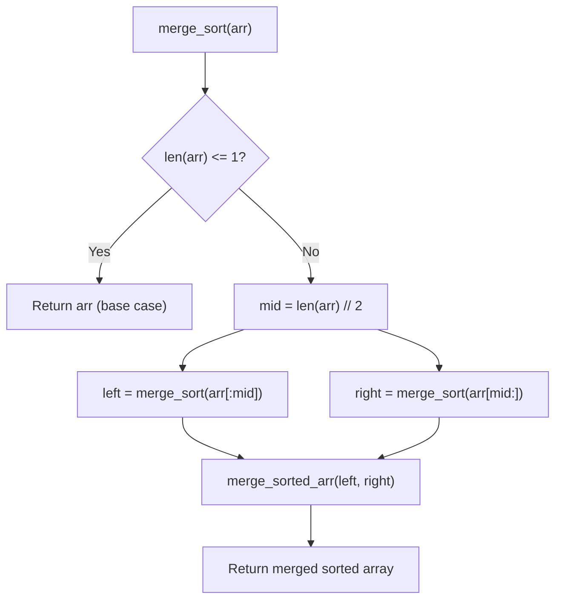

# Merge Sort — Complete Learning Guide

## 1. What Is It?

Merge Sort is a **divide-and-conquer** algorithm. It splits the array in half recursively until
each piece has just one element (trivially sorted), then **merges** those pieces back together
in sorted order, two at a time, all the way back up.

Analogy: sorting two piles of already-sorted playing cards into one pile — you just compare the
top cards of each pile and take the smaller one, repeating until both piles are empty. Merge
Sort applies that "merge two sorted piles" trick recursively.

## 2. Algorithm (Step-by-Step)

**Divide:**
1. If the array has 1 or 0 elements, it's already sorted — return it as-is (base case).
2. Otherwise, split the array into a `left` half and a `right` half at the midpoint.

**Conquer:**
3. Recursively apply Merge Sort to `left`.
4. Recursively apply Merge Sort to `right`.

**Combine:**
5. Merge the two now-sorted halves into a single sorted array:
   - Use two pointers, one for each half.
   - Repeatedly compare the two pointed-at elements and append the smaller one to the result.
   - Once one half is exhausted, append the rest of the other half.

## 3. Visual Walkthrough

Sorting `[5, 1, 4, 2, 8]`:

```text
                         [5, 1, 4, 2, 8]
                         /              \
                  [5, 1]                [4, 2, 8]
                  /    \                /        \
               [5]    [1]           [4]         [2, 8]
                                                  /    \
                                               [2]     [8]

Merging back up:
  [5] + [1]        → merge → [1, 5]
  [2] + [8]        → merge → [2, 8]
  [4] + [2, 8]     → merge → [2, 4, 8]
  [1, 5] + [2,4,8] → merge → [1, 2, 4, 5, 8]

Final: [1, 2, 4, 5, 8]
```

### Zooming into one merge step: `[1, 5]` + `[2, 4, 8]`

```text
left = [1, 5]     right = [2, 4, 8]
 i=0                j=0
result = []

compare left[0]=1 vs right[0]=2 → 1 is smaller → result=[1], i=1
compare left[1]=5 vs right[0]=2 → 2 is smaller → result=[1,2], j=1
compare left[1]=5 vs right[1]=4 → 4 is smaller → result=[1,2,4], j=2
compare left[1]=5 vs right[2]=8 → 5 is smaller → result=[1,2,4,5], i=2 (left exhausted)
append remaining right: 8      → result=[1,2,4,5,8]
```

### Flow Diagram



## 4. Complexity Analysis

| Case    | Time       | Why                                                     |
| ------- | ---------- | ---------------------------------------------------------- |
| Best    | O(n log n) | Splitting always happens regardless of input order          |
| Average | O(n log n) | Same reasoning                                              |
| Worst   | O(n log n) | Same reasoning — Merge Sort has **no bad input**             |

**Why O(n log n)?** The array is split in half `log₂(n)` times (the "levels" of recursion).
At each level, merging all the pieces back together costs O(n) total comparisons. So total
work = (number of levels) × (work per level) = `log₂(n) × n`.

**Space Complexity:** O(n) — merging requires a temporary array to hold the combined result;
this is the main trade-off compared to in-place sorts like Quick Sort.

**Stability:** ✅ Stable — during merging, when `left_arr[i] <= right_arr[j]`, the left
element is taken first, preserving the original relative order of equal elements.

## 5. When Should You Use It?

✅ **Use Merge Sort when:**
- You need **guaranteed** O(n log n) performance, with no worst-case blowup (unlike Quick
  Sort's O(n²) worst case).
- **Stability** matters (e.g., sorting objects by one field while preserving order from a
  previous sort).
- Sorting **linked lists** — merging doesn't need random access, so Merge Sort works
  efficiently on linked lists (O(1) extra space there, unlike arrays).
- Sorting data **too large to fit in memory** — external sorting (merge sort on disk) is the
  standard technique for sorting huge files.

❌ **Avoid it when:**
- Memory is tightly constrained — Quick Sort or Heap Sort sort in-place with O(1)/O(log n)
  extra space.

## 6. Real-World Use Cases

- **External sorting**: sorting massive datasets that don't fit in RAM (databases, big data
  pipelines) by sorting chunks on disk and merging them.
- **Timsort** (Python's `sorted()`, Java's `Arrays.sort()` for objects) is a hybrid of Merge
  Sort and Insertion Sort — it inherits Merge Sort's stability guarantee.
- Sorting linked lists efficiently (e.g., in `java.util.LinkedList`).
- Any scenario requiring a **stable multi-key sort** (sort by name, then by department, and
  the name-order within each department must be preserved).

## 7. Full Python Implementation

```python
def merge_sorted_arr(left_arr, right_arr):
    n, m = len(left_arr), len(right_arr)
    i, j = 0, 0
    arr = []

    # Merge the arrays while comparing elements
    while i < n and j < m:
        if left_arr[i] <= right_arr[j]:
            arr.append(left_arr[i])
            i += 1
        else:
            arr.append(right_arr[j])
            j += 1

    # Append remaining elements (if any)
    while i < n:
        arr.append(left_arr[i])
        i += 1

    while j < m:
        arr.append(right_arr[j])
        j += 1

    return arr


def merge_sort(arr):
    if len(arr) <= 1:
        return arr

    mid = len(arr) // 2
    left = merge_sort(arr[:mid])
    right = merge_sort(arr[mid:])

    return merge_sorted_arr(left, right)


# --------- Example Usage ---------
if __name__ == "__main__":
    arr = [5, 1, 4, 2, 8, 1, 8, 9, 10, 3]
    print("Original array:", arr)
    sorted_arr = merge_sort(arr)
    print("Sorted array:  ", sorted_arr)  # Output: [1, 1, 2, 3, 4, 5, 8, 8, 9, 10]
```

## 8. Quick Recap

| Property | Value |
| -------- | ----- |
| Time (all cases) | O(n log n) |
| Space | O(n) |
| Stable | Yes |
| In-place | No |
| Approach | Divide and conquer |
