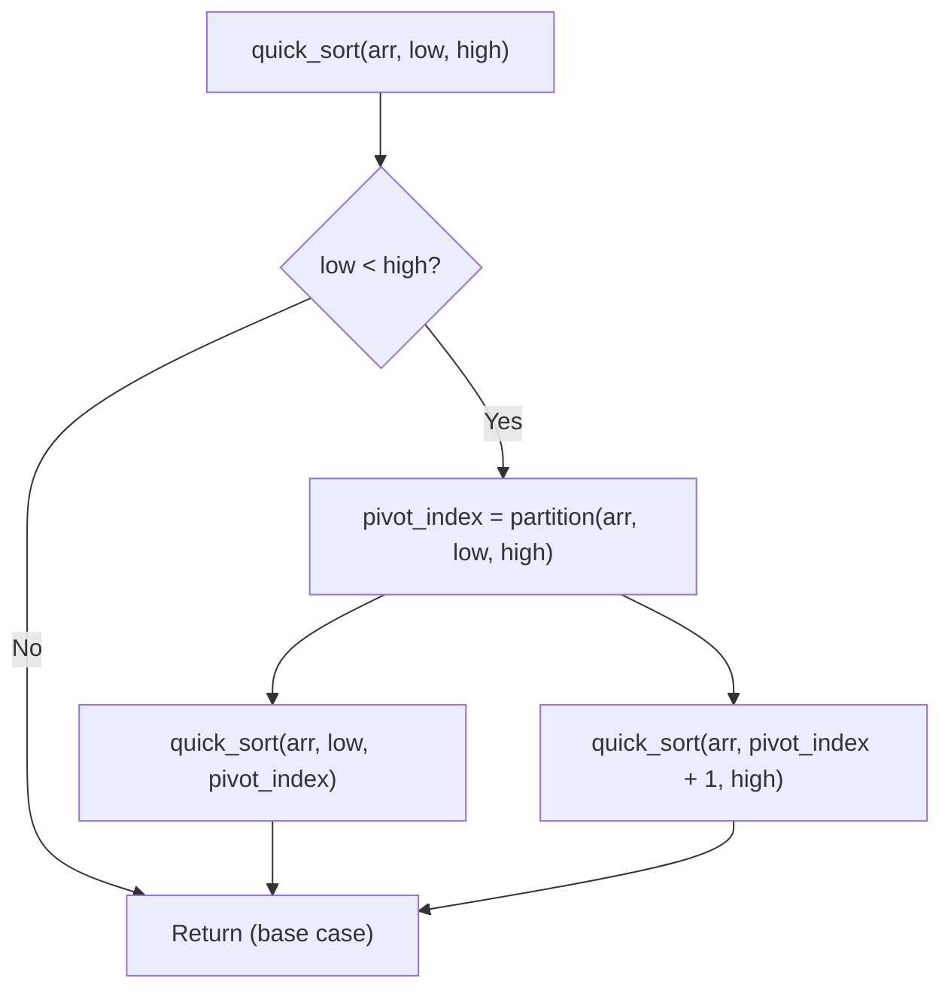

# Quick Sort — Complete Learning Guide

## 1. What Is It?

Quick Sort is a **divide-and-conquer** sorting algorithm that picks a **pivot** element and
rearranges the array so everything smaller than the pivot ends up on its left, and everything
larger ends up on its right. Then it recursively repeats this process on the left and right
partitions. Unlike Merge Sort, it sorts **in-place** and doesn't need extra arrays for merging.

## 2. Algorithm (Step-by-Step)

This implementation uses **Hoare-style partitioning** with the pivot chosen as the first
element (`arr[Low]`):

**Partition step** (`partition(arr, Low, High)`):
1. Set `pivot = arr[Low]`, `i = Low`, `j = High`.
2. Move `i` right while `arr[i] <= pivot`.
3. Move `j` left while `arr[j] >= pivot`.
4. If `i < j`, swap `arr[i]` and `arr[j]` (they were both on the wrong side of the pivot).
5. Repeat 2–4 until `i >= j`.
6. Swap the pivot (`arr[Low]`) with `arr[j]` — this places the pivot in its final sorted
   position, and returns `j` as the pivot's index.

**Quick Sort driver:**
1. If `low < high`, find the pivot's final position via `partition`.
2. Recursively sort the left partition `[low, pivot]`.
3. Recursively sort the right partition `[pivot+1, high]`.
4. Base case: a sub-array with `low >= high` has 0 or 1 elements — already sorted.

## 3. Visual Walkthrough

Sorting `[4, 1, 7, 6, 3, 2, 8]` (pivot = first element of each sub-range):

```text
Initial: [4, 1, 7, 6, 3, 2, 8]   low=0, high=6, pivot=4

Partitioning around pivot=4:
  i scans right while arr[i] <= 4:  4,1 (both <=4)... stops at 7 (index 2)
  j scans left while arr[j] >= 4:   8,2? no 2<4 so j stops at index 5 (value 2)
  i(2)=7, j(5)=2 → i < j → swap → [4, 1, 2, 6, 3, 7, 8]

  continue scanning:
  i moves right from index 2: arr[2]=2 <=4 → i=3 (arr[3]=6, stop, 6>4)
  j moves left from index 5: arr[5]=7 >=4 → j=4 (arr[4]=3, stop, 3<4)
  i(3)=6, j(4)=3 → i < j → swap → [4, 1, 2, 3, 6, 7, 8]

  continue scanning:
  i moves right from 3: arr[3]=3 <=4 → i=4 (arr[4]=6, stop)
  j moves left from 4: arr[4]=6 >=4 → j=3 (arr[3]=3, stop)
  now i(4) >= j(3) → stop inner loop

  swap pivot arr[0] with arr[j=3] → [3, 1, 2, 4, 6, 7, 8]
  pivot 4 is now at index 3 — its FINAL sorted position ✅

Recurse left  on [3, 1, 2]  (indices 0..2)
Recurse right on [6, 7, 8]  (indices 4..6, already in order relative to each other)

... after full recursion ...

Final: [1, 2, 3, 4, 6, 7, 8]
```

### Flow Diagram



## 4. Complexity Analysis

| Case    | Time       | When it happens                                              |
| ------- | ---------- | ---------------------------------------------------------------- |
| Best    | O(n log n) | Pivot always splits the array into two roughly equal halves       |
| Average | O(n log n) | Typical random input                                             |
| Worst   | O(n²)      | Pivot is always the smallest/largest element (e.g., already-sorted input with first-element pivot) |

**Why can worst case happen?** If the array is already sorted and the pivot is always the
first element, every partition splits the array into "0 elements" and "n-1 elements" — this
degenerates into something like Selection Sort, giving O(n²).

**Space Complexity:** O(log n) average (recursion call stack depth), O(n) worst case (when
partitions are maximally unbalanced) — no extra array is used since partitioning is in-place.

**Stability:** ❌ Not stable — swapping elements across the pivot during partitioning can
reorder equal elements.

## 5. When Should You Use It?

✅ **Use Quick Sort when:**
- You want the **fastest average-case, in-place** sort with low memory overhead — this is why
  most language standard libraries use Quick Sort variants for sorting primitive arrays.
- Stability isn't required.
- You can choose a good pivot strategy (random pivot or median-of-three) to avoid worst-case
  behavior on adversarial/sorted inputs.

❌ **Avoid it when:**
- Worst-case guarantees are critical (real-time systems) — use Merge Sort or Heap Sort instead.
- Stability is required — use Merge Sort or Insertion Sort.
- Input might be adversarially crafted to trigger O(n²) (mitigate with randomized pivot
  selection).

## 6. Real-World Use Cases

- **C's `qsort()`**, and many language standard libraries use Quick Sort (or Introsort — a
  Quick Sort/Heap Sort hybrid) to sort primitive arrays because of its excellent average-case
  speed and low memory footprint.
- Used wherever in-place sorting of large arrays matters and stability is not a requirement.
- The **partitioning logic** itself (median-finding, "kth smallest element") is reused in the
  **Quickselect** algorithm — e.g., finding the median or top-k elements in O(n) average time.

## 7. Full Python Implementation

```python
def partition(arr, Low, High):
    """
    Partition the array around a pivot such that:
    - Elements <= pivot are to its left
    - Elements > pivot are to its right

    Parameters:
        arr (list): The array to be partitioned.
        Low (int): The starting index of the subarray.
        High (int): The ending index of the subarray.

    Returns:
        int: The final position (index) of the pivot.
    """
    i, j = Low, High
    pivot = arr[Low]

    while i < j:
        # Move i to the right while arr[i] <= pivot
        while i <= High - 1 and arr[i] <= pivot:
            i += 1

        # Move j to the left while arr[j] >= pivot
        while j >= Low + 1 and arr[j] >= pivot:
            j -= 1

        # Swap if needed
        if i < j:
            arr[i], arr[j] = arr[j], arr[i]

    # Place pivot at the correct position
    arr[Low], arr[j] = arr[j], arr[Low]
    return j


def quick_sort(arr, low, high):
    if low < high:
        pivot = partition(arr, low, high)
        quick_sort(arr, low, pivot)       # Sort left partition
        quick_sort(arr, pivot + 1, high)  # Sort right partition


# --------- Example Usage ---------
if __name__ == "__main__":
    arr = [4, 1, 7, 6, 3, 2, 8]
    print("Original array:", arr)
    quick_sort(arr, 0, len(arr) - 1)
    print("Sorted array:  ", arr)  # Output: [1, 2, 3, 4, 6, 7, 8]
```

## 8. Quick Recap

| Property | Value |
| -------- | ----- |
| Time (best/avg) | O(n log n) |
| Time (worst) | O(n²) |
| Space | O(log n) avg (recursion stack) |
| Stable | No |
| In-place | Yes |
| Approach | Divide and conquer |
