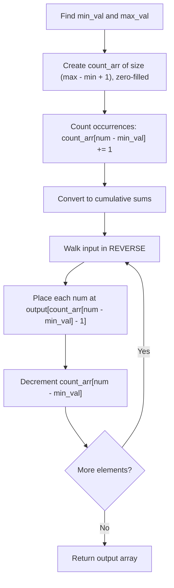

# Counting Sort — Complete Learning Guide

## 1. What Is It?

Counting Sort is a **non-comparison-based** sorting algorithm. Instead of comparing elements
against each other (like Bubble/Merge/Quick Sort do), it counts **how many times each value
appears**, then uses those counts to figure out exactly where each element belongs in the
sorted output.

This makes it extremely fast — O(n + k) — but it only works well for **integers within a
known, reasonably small range** (`k` = range of values).

## 2. Algorithm (Step-by-Step)

This implementation also supports negative numbers by offsetting values with the array's
minimum.

1. Find `min_val` and `max_val` in the input array.
2. Create a `count_arr` of size `max_val - min_val + 1`, initialized to all zeros.
3. **Counting pass:** for every number in the input, increment
   `count_arr[num - min_val]` — this tallies how many times each value occurs.
4. **Cumulative pass:** turn `count_arr` into a running total — `count_arr[i]` now tells you
   how many elements are `<= (i + min_val)`. This gives each value's correct **final index**
   in the sorted output.
5. **Build the output (in reverse, for stability):** walk the *original* input array
   backwards. For each number, look up its position via `count_arr[num - min_val] - 1`, place
   it there in the output array, then decrement the count.
6. Return the output array.

## 3. Visual Walkthrough

Sorting `[4, 2, 2, 8, 3, 3, 1]`:

```text
Input: [4, 2, 2, 8, 3, 3, 1]
min_val = 1, max_val = 8 → count_arr size = 8

Step 1 — Count occurrences (index = value - min_val):
  value:        1  2  3  4  5  6  7  8
  count_arr:  [ 1, 2, 2, 1, 0, 0, 0, 1 ]

Step 2 — Cumulative sum (running total → tells final position boundary):
  value:        1  2  3  4  5  6  7  8
  count_arr:  [ 1, 3, 5, 6, 6, 6, 6, 7 ]
  (meaning: "3 elements are <= value 2", "5 elements are <= value 3", etc.)

Step 3 — Build output, scanning input in REVERSE for stability:
  original (reversed): 1, 3, 3, 8, 2, 2, 4

  num=1: pos = count_arr[0]-1 = 1-1 = 0 → out[0]=1, count_arr[0]-- → 0
  num=3: pos = count_arr[2]-1 = 5-1 = 4 → out[4]=3, count_arr[2]-- → 4
  num=3: pos = count_arr[2]-1 = 4-1 = 3 → out[3]=3, count_arr[2]-- → 3
  num=8: pos = count_arr[7]-1 = 7-1 = 6 → out[6]=8, count_arr[7]-- → 6
  num=2: pos = count_arr[1]-1 = 3-1 = 2 → out[2]=2, count_arr[1]-- → 2
  num=2: pos = count_arr[1]-1 = 2-1 = 1 → out[1]=2, count_arr[1]-- → 1
  num=4: pos = count_arr[3]-1 = 6-1 = 5 → out[5]=4, count_arr[3]-- → 5

Output: [1, 2, 2, 3, 3, 4, 8]
```

Notice there are **no comparisons** between elements anywhere in this process — only counting
and index arithmetic.

### Flow Diagram



## 4. Complexity Analysis

| Case    | Time     | Notes                                       |
| ------- | -------- | -------------------------------------------- |
| Best    | O(n + k) | Always — no comparisons, purely counting     |
| Average | O(n + k) | Always                                       |
| Worst   | O(n + k) | Always — no input order affects performance  |

Where `n` = number of elements, `k` = range of values (`max_val - min_val + 1`).

**Space Complexity:** O(n + k) — the `count_arr` costs O(k), and the output array costs O(n).

**Stability:** ✅ Stable — by iterating the input **in reverse** during the output-building
step, equal elements are placed in the output preserving their original relative order.

**The catch:** if `k` (the range) is much larger than `n` (e.g., sorting `[1, 1000000]`),
you'd allocate a million-element count array for just 2 numbers — this makes Counting Sort
inefficient for sparse/large-range data.

## 5. When Should You Use It?

✅ **Use Counting Sort when:**
- Sorting **integers** within a **small, known range** relative to the number of elements
  (e.g., exam scores 0–100, ages 0–120, single-digit categories).
- You need **guaranteed linear time** and comparison-based O(n log n) sorts aren't fast enough.
- As a **subroutine** inside Radix Sort (see [`07_RadixSort.md`](./07_RadixSort.md)) to sort by
  individual digits.

❌ **Avoid it when:**
- Sorting floating-point numbers, strings, or objects with complex comparison logic.
- The value range `k` is far larger than the number of elements `n` (wastes memory and time).

## 6. Real-World Use Cases

- Sorting exam scores (0–100), ages, or any bounded-range categorical/numeric data.
- **Digit-by-digit sorting inside Radix Sort** — this repo's [Radix Sort](./07_RadixSort.md)
  literally uses a variant of counting sort (`counting_sort_exp`) as its core subroutine.
- Bucketing/histogram-style problems: counting sort's counting phase is itself the basis for
  building frequency histograms.

## 7. Full Python Implementation

```python
def counting_sort(arr):
    # Handle empty array
    if not arr:
        return []

    # Step 1: Find min and max
    max_val = max(arr)
    min_val = min(arr)

    # Step 2: Initialize count array of size (max - min + 1)
    count_arr = [0] * (max_val - min_val + 1)

    # Step 3: Count occurrences of each number
    for num in arr:
        count_arr[num - min_val] += 1

    # Step 4: Cumulative count
    for i in range(1, len(count_arr)):
        count_arr[i] += count_arr[i - 1]

    # Step 5: Build output array (stable sort)
    out_arr = [0] * len(arr)
    for num in reversed(arr):  # reversed to maintain stability
        index = count_arr[num - min_val] - 1
        out_arr[index] = num
        count_arr[num - min_val] -= 1

    return out_arr


# --------- Example Usage ---------
if __name__ == "__main__":
    arr = [4, 2, 2, 8, 3, 3, 1]
    print("Original array:", arr)
    sorted_arr = counting_sort(arr)
    print("Sorted array:", sorted_arr)  # Output: [1, 2, 2, 3, 3, 4, 8]
```

## 8. Quick Recap

| Property | Value |
| -------- | ----- |
| Time (all cases) | O(n + k) |
| Space | O(n + k) |
| Stable | Yes |
| In-place | No |
| Comparison-based | No |
