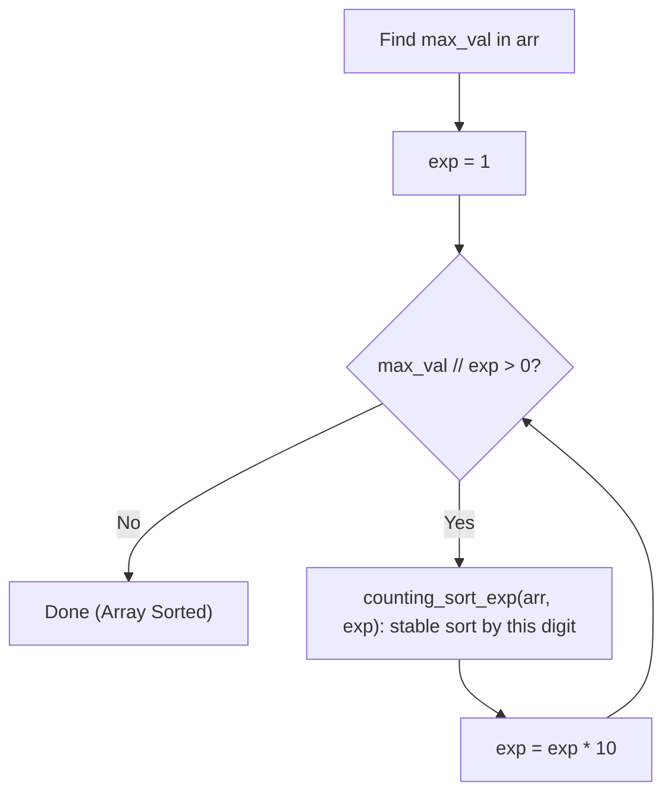

# Radix Sort — Complete Learning Guide

## 1. What Is It?

Radix Sort is a **non-comparison-based** sorting algorithm that sorts integers by processing
one **digit position** at a time — starting from the **least significant digit (LSD)** (the
ones place) and moving toward the **most significant digit (MSD)**. At each digit position, it
uses a **stable** sort (Counting Sort) to reorder the numbers by that digit.

Analogy: sorting punch cards in old mechanical tabulating machines — first sort by the last
digit, then by the second-to-last digit (keeping ties in their previous relative order), and so
on until every digit position has been processed. Because each pass is stable, earlier
sorting decisions are preserved and refined, not undone.

## 2. Algorithm (Step-by-Step)

1. Find `max_val` in the array — this tells you the maximum number of digits you need to
   process.
2. Set `exp = 1` (represents the current digit place: 1s, 10s, 100s, ...).
3. While `max_val // exp > 0` (i.e., there are still digits left to process):
   - Run `counting_sort_exp(arr, exp)` to stably sort the array by the digit at place `exp`.
   - Multiply `exp *= 10` to move to the next digit place.
4. After processing every digit place, the array is fully sorted.

**`counting_sort_exp(arr, exp)`** — Counting Sort specialized for a single digit:
1. Create a `count` array of size 10 (digits 0–9) and an `output` array of size `n`.
2. For each number, extract its digit at place `exp` via `(num // exp) % 10`, and increment
   `count[digit]`.
3. Convert `count` to cumulative sums (as in standard Counting Sort).
4. Walk the array **in reverse** (for stability), placing each number into `output` at the
   position given by its digit's cumulative count, then decrementing that count.
5. Copy `output` back into `arr`.

## 3. Visual Walkthrough

Sorting `[170, 45, 75, 90, 802, 24, 2, 66]`:

```text
Input: [170, 45, 75, 90, 802, 24, 2, 66]
max_val = 802 → has 3 digits → we need passes for exp = 1, 10, 100

──────────────────────────────────────────────
Pass 1 — sort by ONES digit (exp = 1):
  number : 170  45  75  90  802  24   2  66
  digit  :   0   5   5   0    2   4   2   6

  → stable sort by this digit gives:
  [170, 90, 802, 2, 24, 45, 75, 66]
  (all the "0"s first in original relative order, then "2"s, "4", "5"s, "6")

──────────────────────────────────────────────
Pass 2 — sort by TENS digit (exp = 10):
  number : 170  90  802   2  24  45  75  66
  digit  :   7   9    0   0   2   4   7   6

  → stable sort by this digit gives:
  [802, 2, 24, 45, 66, 170, 75, 90]

──────────────────────────────────────────────
Pass 3 — sort by HUNDREDS digit (exp = 100):
  number : 802   2  24  45  66  170  75  90
  digit  :   8   0   0   0   0    1   0   0

  → stable sort by this digit gives:
  [2, 24, 45, 66, 170, 75, 90, 802]

max_val // exp (802 // 1000 = 0) → loop ends

Final: [2, 24, 45, 66, 75, 90, 170, 802]
```

The key insight: because each digit-pass uses a **stable** sort, numbers that tie on the
current digit keep the relative order established by the *previous* (less significant) digit
pass — that's what makes the final result fully sorted after all digit places are processed.

### Flow Diagram



## 4. Complexity Analysis

| Case    | Time   | Notes                                                |
| ------- | ------ | ------------------------------------------------------- |
| Best    | O(n·k) | Always — no comparisons                                  |
| Average | O(n·k) | Always                                                    |
| Worst   | O(n·k) | Always — performance is driven by digit count, not order |

Where `n` = number of elements, `k` = number of digits in the largest number
(`k ≈ log₁₀(max_val)`).

**Space Complexity:** O(n + k) — each digit pass allocates an `output` array of size `n` and a
`count` array of size 10 (constant).

**Stability:** ✅ Stable overall — this is essential and non-negotiable, because Radix Sort's
correctness *depends on* each digit pass preserving order from the previous pass.

**When is O(n·k) good?** If `k` (digit count) is small and fixed (e.g., sorting 32-bit
integers has at most ~10 decimal digits), `k` behaves like a constant, making Radix Sort
effectively **O(n)** — faster than any comparison-based sort's O(n log n) lower bound.

## 5. When Should You Use It?

✅ **Use Radix Sort when:**
- Sorting large collections of **fixed-length integers** (or strings) where the number of
  digits/characters is small relative to `n`.
- You need better-than-O(n log n) performance and the comparison-sort lower bound doesn't
  apply (Radix Sort sidesteps it entirely by not comparing elements).

❌ **Avoid it when:**
- Sorting floating-point numbers or negative numbers without adaptation (this implementation
  handles non-negative integers only).
- The numbers have wildly varying digit counts, or very large digit counts (`k` becomes large,
  eroding the near-linear advantage).
- Sorting objects with complex/composite comparison logic that isn't naturally digit-based.

## 6. Real-World Use Cases

- Sorting large sets of **fixed-width identifiers**: phone numbers, postal/zip codes, student
  IDs, IP addresses (often processed byte-by-byte, same idea as digit-by-digit).
- Sorting strings **lexicographically** by treating characters as "digits" (a common variant:
  MSD Radix Sort for strings, used in specialized string-processing pipelines).
- Historically used in **punch-card sorting machines** — the literal origin of the technique.
- Suitable for sorting large integer keys in external/distributed sorting systems where
  avoiding comparisons reduces I/O overhead.

## 7. Full Python Implementation

```python
def counting_sort_exp(arr, exp):
    n = len(arr)
    output = [0] * n          # Output array for sorted elements
    count = [0] * 10          # Count array for digits (0-9)

    # Count occurrences of digits at current place value
    for i in arr:
        index = (i // exp) % 10
        count[index] += 1

    # Cumulative count to determine positions
    for i in range(1, 10):
        count[i] += count[i - 1]

    # Build the output array (traverse input array in reverse for stability)
    for i in range(n - 1, -1, -1):
        index = (arr[i] // exp) % 10
        output[count[index] - 1] = arr[i]
        count[index] -= 1

    # Copy output back into original array
    for i in range(n):
        arr[i] = output[i]


def radix_sort(arr):
    if not arr:
        return

    max_val = max(arr)
    exp = 1  # Starting with least significant digit
    while max_val // exp > 0:
        counting_sort_exp(arr, exp)
        exp *= 10


# --------- Example Usage ---------
if __name__ == "__main__":
    lst = [170, 45, 75, 90, 802, 24, 2, 66]
    print("Original list:", lst)
    radix_sort(lst)
    print("Sorted list:  ", lst)  # Output: [2, 24, 45, 66, 75, 90, 170, 802]
```

## 8. Quick Recap

| Property | Value |
| -------- | ----- |
| Time (all cases) | O(n·k) |
| Space | O(n + k) |
| Stable | Yes (requires a stable digit sort) |
| In-place | No |
| Comparison-based | No |

## 9. Comparing All Sorting Algorithms in This Repo

| Algorithm | Best | Average | Worst | Space | Stable? |
| --------- | ---- | ------- | ----- | ----- | ------- |
| [Bubble Sort](./01_BubbleSort.md) | O(n) | O(n²) | O(n²) | O(1) | Yes |
| [Selection Sort](./02_SelectionSort.md) | O(n²) | O(n²) | O(n²) | O(1) | No |
| [Insertion Sort](./03_InsertionSort.md) | O(n) | O(n²) | O(n²) | O(1) | Yes |
| [Merge Sort](./04_MergeSort.md) | O(n log n) | O(n log n) | O(n log n) | O(n) | Yes |
| [Quick Sort](./05_QuickSort.md) | O(n log n) | O(n log n) | O(n²) | O(log n) | No |
| [Counting Sort](./06_CountSort.md) | O(n + k) | O(n + k) | O(n + k) | O(n + k) | Yes |
| [Radix Sort](./07_RadixSort.md) | O(n·k) | O(n·k) | O(n·k) | O(n + k) | Yes |
