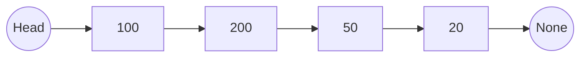
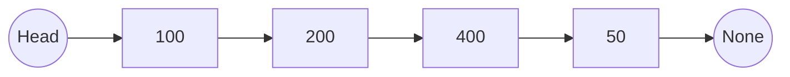
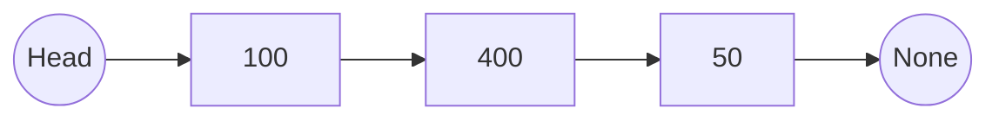

# Singly Linked List in Python

A **singly linked list (SLL)** is a fundamental data structure in computer science. It is particularly useful for scenarios requiring **dynamic memory allocation**, frequent **insertions**, and **deletions**. Unlike arrays, linked lists do not require contiguous memory and can grow or shrink as needed.

---

## 1. Defining a Node

A singly linked list is composed of **nodes**, where each node contains:

- `val` → The data value  
- `next` → A reference (pointer) to the next node  

```python
class Node:
    def __init__(self, val=None):
        self.val = val          # Stores the value of this node
        self.next = None        # Points to the next node (initially None)
````

---

## 2. The Singly Linked List Class

The `SinglyLinkedList` class manages the entire list. It maintains a reference to the **head node** (the first node).

```python
class SinglyLinkedList:
    def __init__(self):
        self.head = None    # Head points to the first node in the list
```

---

## 3. Appending a Node (Insert at End)

### Code

```python
def append(self, data):
    new_node = Node(data)
    if not self.head:          # Empty list
        self.head = new_node
    else:
        current = self.head
        while current.next is not None:
            current = current.next
        current.next = new_node
```

### Diagram

#### Before Append

```
Head → [100 | next] → [200 | next] → [50 | None]
```

#### After `append(20)`

```
Head → [100 | next] → [200 | next] → [50 | next] → [20 | None]
```

**Mermaid Diagram**



---

## 4. Traversing the List (Printing)

```python
def traverse(self):
    if not self.head:
        print("Singly Linked List is empty")
    else:
        current = self.head
        while current is not None:
            print(current.val, end=" ")
            current = current.next
        print()
```

---

## 5. Inserting a Node at a Specific Position

### Code

```python
def insert_at(self, data, position):
    new_node = Node(data)
    if position == 0:  # Insert at head
        new_node.next = self.head
        self.head = new_node
    else:
        current = self.head
        prev_node = None
        count = 0
        while current is not None and count < position:
            prev_node = current
            current = current.next
            count += 1
        new_node.next = current
        if prev_node:
            prev_node.next = new_node
```

### Diagram

#### Before Insert

```
Head → [100] → [200] → [50]
```

#### After `insert_at(400, 2)`

```
Head → [100] → [200] → [400] → [50]
```

**Mermaid Diagram**



---

## 6. Deleting the Head Node

### Code

```python
def delete_head(self):
    if not self.head:
        print("Cannot delete. Singly Linked List is already empty")
    else:
        self.head = self.head.next
```

### Diagram

#### Before

```
Head → [43] → [100] → [200]
```

#### After `delete_head()`

```
Head → [100] → [200]
```

---

## 7. Deleting a Node by Value

### Code

```python
def delete(self, val):
    temp = self.head
    if temp and temp.val == val:  # Deleting head
        self.head = temp.next
        return

    prev = None
    found = False
    while temp is not None:
        if temp.val == val:
            found = True
            break
        prev = temp
        temp = temp.next

    if found:
        prev.next = temp.next
    else:
        print("Node not found")
```

### Diagram

#### Before Delete

```
Head → [100] → [200] → [400] → [50]
```

#### After `delete(200)`

```
Head → [100] → [400] → [50]
```

**Mermaid Diagram**



---

## 8. Demonstration of Operations

```python
sll = SinglyLinkedList()

# Append nodes
sll.append(100)
sll.append(200)
sll.append(50)
sll.append(20)
sll.traverse()      # Output: 100 200 50 20

# Insert nodes
sll.insert_at(43, 0)      # At head
sll.traverse()            # Output: 43 100 200 50 20

sll.insert_at(400, 3)     # At position 3
sll.traverse()            # Output: 43 100 200 400 50 20

# Delete head
sll.delete_head()
sll.traverse()            # Output: 100 200 400 50 20

# Delete by value
sll.delete(2000)          # Not found
sll.traverse()            # Output: 100 200 400 50 20
```

---

## 9. Complexity Analysis

| Operation       | Time Complexity | Space Complexity |
| --------------- | --------------- | ---------------- |
| Append          | O(N)            | O(1)             |
| Traverse        | O(N)            | O(1)             |
| Insert at       | O(N)            | O(1)             |
| Delete Head     | O(1)            | O(1)             |
| Delete by Value | O(N)            | O(1)             |

* **N = number of nodes**
* Insert/delete at **head** is constant-time (O(1)).
* Other operations require traversal (**O(N)**).

---

## 🔁 10. Singly Linked List vs Arrays

| Feature                     | Singly Linked List (SLL)                         | Array (List in Python)                                         |
| --------------------------- | ------------------------------------------------ | -------------------------------------------------------------- |
| Memory Allocation           | Dynamic (nodes scattered, connected by pointers) | Contiguous memory block                                        |
| Access Time (Random Access) | O(N) (traverse required)                         | O(1) (direct index access)                                     |
| Insertion at Head           | O(1)                                             | O(N) (shifting elements)                                       |
| Insertion at Middle/End     | O(N) (traverse required)                         | O(N) (shifting required for middle, amortized O(1) for append) |
| Deletion at Head            | O(1)                                             | O(N) (shifting elements)                                       |
| Deletion by Value           | O(N)                                             | O(N)                                                           |
| Cache Friendliness          | Poor (non-contiguous nodes)                      | Excellent (contiguous)                                         |
| Extra Space Requirement     | O(1) per node (for `next` pointer)               | None                                                           |

### 👉 When to Use:

* **Linked List** → Frequent insertions/deletions, dynamic data size.
* **Array** → Fast random access, fixed or predictable size.

---

## ✅ Summary

* Linked lists are made of **nodes connected by pointers**.
* They allow **efficient insertions and deletions** at the head.
* Unlike arrays, they do not require **contiguous memory**.
* Arrays are better for **fast access**, while linked lists are better for **dynamic changes**.

---


