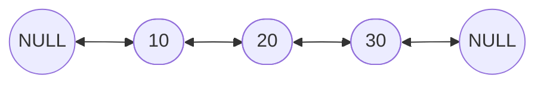
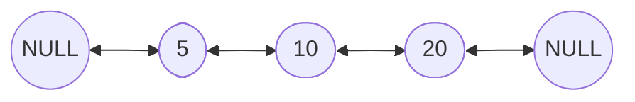
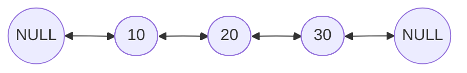
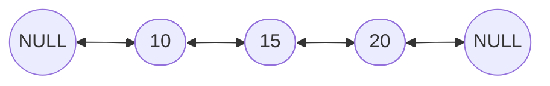
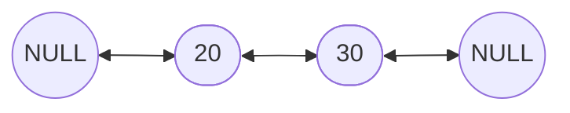
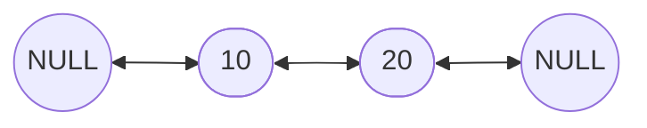

# Doubly Linked List in Python

A **Doubly Linked List (DLL)** is a type of linked list where each node contains three fields:

1. **Prev** → pointer to the previous node
2. **Data** → stores the value
3. **Next** → pointer to the next node

Unlike a singly linked list, DLL supports **bi-directional traversal**.

---

## 🔹 Node Structure

```
+---------+---------+---------+
|  Prev   |  Data   |  Next   |
+---------+---------+---------+
```

---

## 🔹 Visualization

### Example of a DLL with 3 nodes:

```
NULL <- [10] <-> [20] <-> [30] -> NULL
```

### Mermaid Flowchart



---

## 🔹 Implementation in Python

### 1. Define Node

```python
class Node:
    def __init__(self, data):
        self.data = data
        self.prev = None
        self.next = None
```

---

### 2. Doubly Linked List Class

```python
class DoublyLinkedList:
    def __init__(self):
        self.head = None

    # Traverse Forward
    def display_forward(self):
        if self.head is None:
            print("List is empty")
            return
        temp = self.head
        while temp:
            print(temp.data, end=" <-> " if temp.next else "\n")
            temp = temp.next

    # Traverse Backward
    def display_backward(self):
        if self.head is None:
            print("List is empty")
            return
        temp = self.head
        while temp.next:
            temp = temp.next  # go to last node
        while temp:
            print(temp.data, end=" <-> " if temp.prev else "\n")
            temp = temp.prev
```

---

## 🔹 Operations

### 1. Insertion

#### a) Insert at Beginning

```python
    def insert_begin(self, data):
        new_node = Node(data)
        if self.head is None:
            self.head = new_node
            return
        new_node.next = self.head
        self.head.prev = new_node
        self.head = new_node
```

**Explanation:**

* Create a new node
* Point its `next` to current head
* Update old head’s `prev` to new node
* Make new node the head

**Diagram:**



---

#### b) Insert at End

```python
    def insert_end(self, data):
        new_node = Node(data)
        if self.head is None:
            self.head = new_node
            return
        temp = self.head
        while temp.next:
            temp = temp.next
        temp.next = new_node
        new_node.prev = temp
```

**Explanation:**

* Traverse to the last node
* Connect new node’s `prev` to last node
* Update last node’s `next` to new node

**Diagram:**



---

#### c) Insert After a Given Node

```python
    def insert_after(self, key, data):
        temp = self.head
        while temp and temp.data != key:
            temp = temp.next
        if temp is None:
            print("Key not found")
            return
        new_node = Node(data)
        new_node.next = temp.next
        new_node.prev = temp
        if temp.next:
            temp.next.prev = new_node
        temp.next = new_node
```

**Explanation:**

* Search for the node with given `key`
* Link new node’s `next` to `key.next`
* Adjust `prev` links accordingly

**Diagram:**



---

### 2. Deletion

#### a) Delete Beginning

```python
    def delete_begin(self):
        if self.head is None:
            print("List is empty")
            return
        if self.head.next is None:
            self.head = None
            return
        self.head = self.head.next
        self.head.prev = None
```

**Explanation:**

* Move head to `head.next`
* Set new head’s `prev = None`

**Diagram:**



---

#### b) Delete End

```python
    def delete_end(self):
        if self.head is None:
            print("List is empty")
            return
        if self.head.next is None:
            self.head = None
            return
        temp = self.head
        while temp.next:
            temp = temp.next
        temp.prev.next = None
```

**Explanation:**

* Traverse to the last node
* Set its `prev.next = None` (unlink last node)

**Diagram:**


---

#### c) Delete a Node by Value

```python
    def delete_value(self, key):
        if self.head is None:
            print("List is empty")
            return
        temp = self.head

        if temp.data == key:
            self.delete_begin()
            return

        while temp and temp.data != key:
            temp = temp.next

        if temp is None:
            print("Key not found")
            return

        if temp.next:
            temp.next.prev = temp.prev
        if temp.prev:
            temp.prev.next = temp.next
```

**Explanation:**

* Find the node with given `key`
* Adjust its `prev.next` and `next.prev` pointers
* Node is skipped and effectively deleted

**Diagram (Deleting 15):**



---

### 3. Traversal

* **Forward Traversal** → Start from `head` and keep moving using `next`
* **Backward Traversal** → Move to last node first, then traverse backward using `prev`

```python
dll.display_forward()   # left → right
dll.display_backward()  # right → left
```

---

## 🔹 Example Usage

```python
dll = DoublyLinkedList()
dll.insert_end(10)
dll.insert_end(20)
dll.insert_begin(5)
dll.insert_after(10, 15)

print("Forward Traversal:")
dll.display_forward()

print("Backward Traversal:")
dll.display_backward()

dll.delete_value(15)
dll.delete_begin()
dll.delete_end()

print("After Deletions (Forward):")
dll.display_forward()
```

---

## 🔹 Output

```
Forward Traversal:
5 <-> 10 <-> 15 <-> 20
Backward Traversal:
20 <-> 15 <-> 10 <-> 5
After Deletions (Forward):
10
```

---

## ✅ Advantages

* Supports **bi-directional traversal**
* Deletion is easier (no need to search for previous node separately)
* Efficient insertion and deletion at both ends

---

## ❌ Disadvantages

* Extra memory required for `prev` pointer
* Slightly more complex to implement

---

## 🚀 Applications

* **Undo/Redo** in text editors
* **Browser navigation** (forward/backward history)
* **Music/Video playlist navigation**
* **Deque implementation**

---
